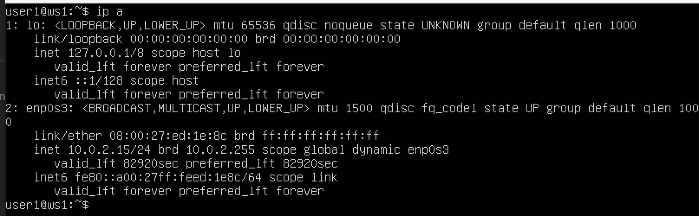
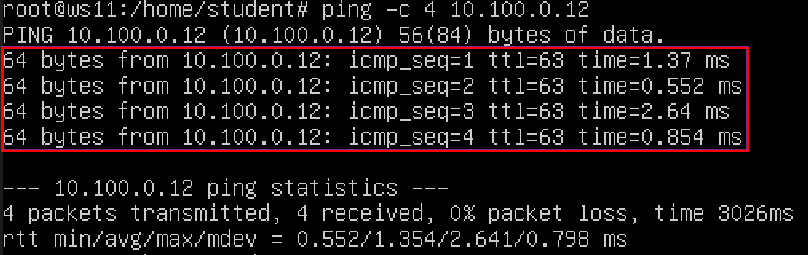
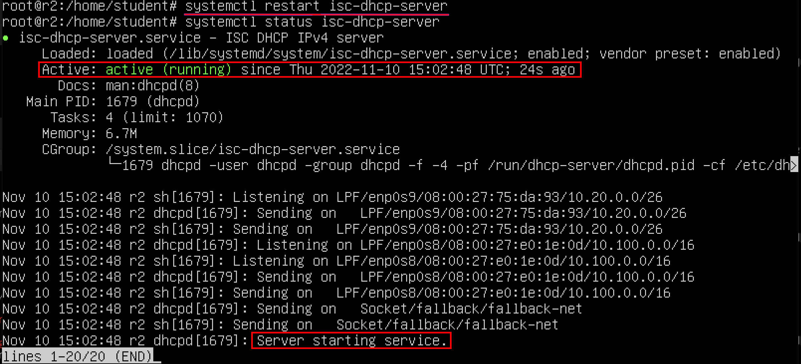

# Part 1. Инструмент ipcalc ##

    Создание виртуальной машины ws1 и установка инструмента ipcalc

    1.1. Сети и маски

1) Определение адреса сети 192.167.38.54/13

2) Перевод масок

- ##### 255.255.255.0 в префиксную и двоичную запись #####

- ##### /15 в обычную и двоичную: #####

##### 11111111.11111111.11111111.11110000 в обычную и префиксную: #####

3) Минимальный и максимальный хост в сети 12.167.38.4

- при маске /8

- при маске 11111111.11111111.00000000.00000000

- при маске 255.255.254.0 

- при маске /4

    1.2. localhost

- Определить, можно ли обратиться к приложению, работающему на localhost, со следующими IP: 194.34.23.100, 127.0.0.2, 127.1.0.1, 128.0.0.1

##### localhost - стандартное, официально зарезервированное доменное имя для частных IP-адресов в диапазоне 127.0.0.1 — 127.255.255.254 по RFC 2606 #####

- 194.34.23.100 - нельзя
- 127.0.0.2 - можно
- 127.1.0.1 - можно
- 128.0.0.1 - нельзя
---

    1.3. Диапазоны и сегменты сетей

1) Какие из перечисленных IP можно использовать в качестве публичного, а какие только в качестве частных

Диапазоны частных "серых" ip-адресов: 
- 10.0.0.0 - 10.255.255.255 
- 172.16.0.0 - 172.31.255.255 
- 192.168.0.0 - 192.168.255.255 

Публичные адреса:
- 134.43.02 
- 172.0.0.2.1
- 172.68.0.2
- 192.172.0.0.1 

Частные адреса: 

- 10.0.0.45
- 192.168.4.2
- 172.20.250.4
- 172.16.255.255
- 10.10.10.10

2) Какие из перечисленных IP адресов шлюза возможны у сети 10.10.0.0/18: 

- 10.0.0.1 - нет, относится к сети 10.0.0.0
- 10.10.0.2 - да
- 10.10.10.10 - да
- 10.10.100.1 - нет, относится к сети 10.10.64.0 
- 10.10.1.255 - да

## Part 2. Статическая маршрутизация между двумя машинами ##

    2.0.0.1. Создание виртуальной машины ws2 и просмотр существующих сетевых интерфейсов

- Вывод команды ip a для машины ws1

- Вывод команды ip a для машины ws2

    2.0.0.1. Описание сетевого интерфейса, соответствующего внутренней сети, на обеих машинах и со следующими адресами и масками:
    ws1 - 192.168.100.10/16, ws2 - 172.24.116.8/12

- Установка для машины ws1 адреса 192.168.100.10/16

- Установка для машины ws2 адреса 172.24.116.8/12

    2.0.0.2. Выполнение команды netplan apply для перезапуска сервиса сети и вывод использованной команды

- Выполнение команды natplan apply для машины ws1

- Выполнение команды natplan apply для машины ws2

    2.1. Добавление статического маршрута вручную

- Добавление статического маршрута от машины ws1 к ws2 и вывод результата пингования

- Добавление статического маршрута от машины ws2 к ws1 и вывод результата пингования

    2.2. Добавление статического маршрута с сохранением

- Добавление статического маршрута от машины ws1 к ws2 после перезапуска

- Добавление статического маршрута от машины ws2 к ws1 после перезапуска

- Вывод результата пингования машины ws1 к ws2

- Вывод результата пингования машины ws2 к ws1

## Part 3. Утилита iperf3 ##

    3.1. Скорость соединения

Перевод скорости соединения:

- 8 Mbps = 1 MB/s   
- 100 MB/s = 800 000 Kbps  
- 1 Gbps = 1000 Mbps
---

    3.2. Утилита iperf3

Измерение скорости соединения между ws1 и ws2 с помощью утилиты iperf3 -s

 
 

## Part 4. Сетевой экран ##

    4.1. Утилита iptables

- Содержание файла /etc/firewall.sh для машины ws1

- Содержание файла /etc/firewall.sh для машины ws2

Стратегия для ws1:

1) На ws1 применение стратегии, когда в начале пишется запрещающее правило, а в конце пишется разрешающее правило (это касается пунктов 3 и 4)

2) Открыть на машине доступ для порта 22 (ssh) и порта 80 (http)

3) Запретить echo reply (машина не должна "пинговаться”, т.е. должна быть блокировка на OUTPUT)

4) Разрешить echo reply (машина должна "пинговаться")

Стратегия для ws2:

1) На ws2 применение стратегии, когда в начале пишется разрешающее правило, а в конце пишется запрещающее правило (это касается пунктов 3 и 4)

2) Открыть на машине доступ для порта 22 (ssh) и порта 80 (http)

3) Разрешить echo reply (машина должна "пинговаться")

4) Запретить echo reply (машина не должна "пинговаться”, т.е. должна быть блокировка на OUTPUT)
 
- Запуск файлов на обеих машинах командами chmod +x /etc/firewall.sh и /etc/firewall.sh

    4.2. Утилита nmap

- Поиск командой ping машину, которая не "пингуется", после чего вывод утилитой nmap о том, что хост машины запущен (в выводе должно быть сказано: Host is up)

## Part 5. Статическая маршрутизация сети ##

    5.1. Настройка адресов машин

Настройки конфигурации машин в etc/netplan/00-installer-config.yaml

- ws11

- ws21

- ws22

- r1

- r2

- Адрес машины ws11 после перезапуска и пинговка с r1

- Адрес машины ws21 после перезапуска и пинговка с w22

- Адрес машины ws22 после перезапуска и пинговка с w21

- Адрес машины r1 после перезапуска и пинговка с w11

- Адрес машины r2 после перезапуска

    5.2. Включение переадресации IP-адресов

Выполнение команды sysctl -w net.ipv4.ip_forward=1 на роутерах для включения переадресации IP

- При таком подходе переадресация не будет работать после перезагрузки системы

Добавление в файл /etc/sysctl.conf следующей строки net.ipv4.ip_forward = 1

- При использовании этого подхода, IP-переадресация включена на постоянной основе
---

    5.3. Установка маршрута по-умолчанию

- Настройка маршрута по-умолчанию (шлюз) для рабочих станций при помощи gateway4 [ip роутера] в файле конфигураций

Скрины с содержанием файла etc/netplan/00-installer-config.yaml для рабочих станций

- Вывод команды ip r с новым маршрутом в таблице маршрутизации

- Пинг с ws11 на роутер r2

- Проверка, что пинг доходит до r2

    5.4. Добавление статических маршрутов

Добавление в роутеры r1 и r2 статических маршрутов в файле конфигураций

- Вызов ip r для машины r1

- Вызов ip r для машины r2

- Запуск команд ip r list 10.10.0.0/18 и ip r list 0.0.0.0/0 на ws11

##### Маршруту с подсетью 0.0.0.0/0 иногда придают особое значение и называют «Маршрут по умолчанию» (Default Route) или «Шлюз последней надежды» (gateway of last resort). Он указывает на шлюз, куда пересылать пакеты для которых нет других, более точных, маршрутов. Если задано несколько маршрутов, пересекающихся по адресам назначения, то более приоритетным будет более точный маршут (с большей маской), а менее приоритетным -  более общий маршрут (с меньшей маской). Маршрут по умолчанию имеет наименьший приоритет. ##### 
---
    5.5. Построение списка маршрутизаторов

- Вывод команды tcpdump -tnv -i enp0s8 на машине r1

 

- Вывод списка маршрутизаторов на пути от ws11 до ws21 при помощи утилиты traceroute

 

##### Для определения промежуточных маршрутизаторов traceroute отправляет серию пакетов данных целевому узлу, при этом каждый раз увеличивая на 1 значение поля TTL («время жизни»). Это поле обычно указывает максимальное количество маршрутизаторов, которое может быть пройдено пакетом. Первый пакет отправляется с TTL, равным 1, и поэтому первый же маршрутизатор возвращает обратно сообщение ICMP, указывающее на невозможность доставки данных. Traceroute фиксирует адрес маршрутизатора, а также время между отправкой пакета и получением ответа (эти сведения выводятся на монитор компьютера). Затем traceroute повторяет отправку пакета, но уже с TTL, равным 2, что позволяет первому маршрутизатору пропустить пакет дальше. Процесс повторяется до тех пор, пока при определённом значении TTL пакет не достигнет целевого узла. При получении ответа от этого узла процесс трассировки считается завершённым. #####
---

    5.6. Использование протокола ICMP при маршрутизации

- Вывод команды tcpdump -n -i eth0 icmp на машине r1 для перехвата сетевого трафика

 

Вывод команды ping -c 1 10.30.0.111 на машине ws11

## Part 6. Динамическая настройка IP с помощью DHCP ##

1) Изменение конфигурации службы DHCP в файле /etc/dhcp/dhcpd.conf для r2 

Изменение адреса маршрутизатора по-умолчанию, DNS-сервера и адреса внутренней сети

Изменение в файле resolv.conf nameserver 8.8.8.8

Перезагрузка службы DHCP командой systemctl restart isc-dhcp-server

Перезагрузка машины ws21 при помощи команды reboot и вывод через ip a полученный адрес

Пинг ws22 с ws21

2)  Изменение файла /etc/netplan/00-installer-config.yaml для машины ws11 c добавлением строки: macaddress: 10:10:10:10:10:BA, dhcp4: true 

Изменение файла /etc/dhcp/dhcpd.conf для машины r1 c выдачей адресов с жесткой привязкой к MAC-адресу (ws11)

Изменение в файле resolv.conf nameserver 8.8.8.8

Перезагрузка службы DHCP командой systemctl restart isc-dhcp-server

Проверка, что адрес с привязкой к mac-адресу:

Пинг ws22 с ws11

8) Запрос с ws21 обновление ip-адреса

- ip машины ws21 до обновления

- Новый ip-адрес после запроса с сервера

##### dhclient - r -> освободить занятый ip-адрес, в данном случае 10.20.0.2 #####

##### dhclient enp0s8  -> запросить новый ip на интерфейс enp0s8, выдаст первый свободный, выдал 10.20.0.3 #####

## Part 7. NAT ##

- Изменение файла /etc/apache2/ports.conf на машинах ws22 и r1

- Вызов команды service apache2 start на машинах ws22 и r1

- Создание фаервола на r2 с заданными правилами

1) Удаление правил в таблице filter - ` iptables -F `
2) Удаление правил в таблице "NAT" - ` iptables -F -t nat `
3) Отбрасывать все маршрутизируемые пакеты - ` iptables --policy FORWARD DROP `

- Запуск firewall.sh на машине r2

- Проверка соединения между ws22 и r1 - cоединение не проходит (При запуске файла с этими правилами, ws22 НЕ должна "пинговаться" с r1)

- Добавление в firewall еще одного правила - разрешить маршрутизацию всех пакетов протокола ICMP

- Проверка соединения между ws22 и r1 (При запуске файла с этими правилами, ws22 должна "пинговаться" с r1)

- Добавление в firewall еще правил:

1) Включение SNAT, а именно маскирование всех локальных ip из локальной сети, находящейся за r2 (по обозначениям из Части 5 - сеть 10.20.0.0)
2) Включение DNAT на 8080 порт машины r2 и добавление к веб-серверу Apache, запущенному на ws22, доступ извне сети

- Проверка соединения по TCP для SNAT машины ws22 с r1

- Проверка соединения по TCP для DNAT машины r1 с ws22

## Part 8. Дополнительно. Знакомство с SSH Tunnels ##

- Изменение файла /etc/apache2/ports.conf на машине ws22

-  Выполнение Local TCP forwarding с ws21 до ws22, чтобы получить доступ к веб-серверу на ws22 с ws21

- Выполнение Remote TCP forwarding c ws11 до ws22, чтобы получить доступ к веб-серверу на ws22 с ws11

- Проверка подключения

